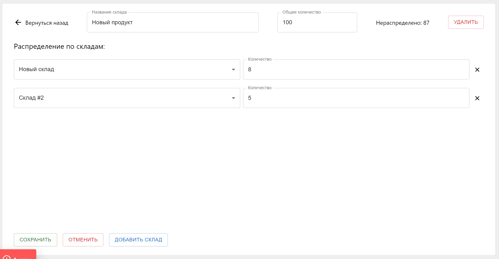

# 
JUSTICE WAREHOUSES

Используемые технологии:

Принцип работы web-приложения:

При первом входе мы видим две пустые страницы (склады и продукты):

Нам необходимо создать первый склад или продукт:

Теперь, когда склад существует, при создании продукта мы можем сразу распределить его на этот склад:

Аналогичная ситуация и со складами, если в хранилище есть продукты, то при создании склада мы можем сразу распределить на него продукцию:

На странице склада мы можем расределять на него продукцию из нераспределенных запасов:

При удалении продукции со склада она возвращается в нераспределенные запасы:

Также есть возможность перемещать продукцию со склада на склад:

И распределять продукт по складам со страницы продукта:
